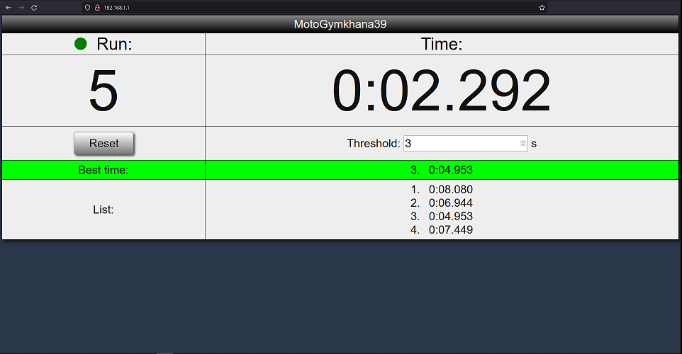

#TO BE FILLED

## Gymkhana Run Timer
Run timer on ESP8266 with web interface.
Based on DonKracho's [project](https://create.arduino.cc/projecthub/DonKracho/esp8266-lap-timer-with-web-server-d6183a)

## About
Measures time of a single run: from start to finish. After first interrupt of sensors

After powering up, ESP8266 creates access point `SSID` with web server with IP `WEB_SERVER_IP` (default: 192.168.1.1).

Just connect to AP, execute favourite browser and enter `WEB_SERVER_IP`)

### Hardware
- MCU ESP8266 (e.g. board Wemos D1 mini);
- E3F-R2NK (photoelectric sensor with IR transmitter, NPN, NO);
- Mini360 buck converter (to power from 12V batteries).

### Features
- Indicator of sensor's signal presence (useful thing during sensor and reflector installation);
- Current number of run and time;
- List of all runs;
- Best run;
- Customizable time threshold  via web UI (after interruption, the system ignores further interrupts during `threshold_ms` milliseconds).

## Arduino IDE settings
For WEMOS choose board LOLIN(WEMOS) D1 R2 & mini

## Dependencies
I used the following setup and libs:
 - Arduino IDE 1.8.10
 - esp8266 board 2.5.2. Link for board manager: http://arduino.esp8266.com/stable/package_esp8266com_index.json

| Lib					| Version	| Source		|
| ----------------------|-----------|---------------|
| 1) ESP8266WebServer	| 1.0		| esp8266 board	|
| 2) ESP8266WiFi		| 1.0		| esp8266 board	|
| 3) WebSockets			| 2.3.6		| lib manager	|

