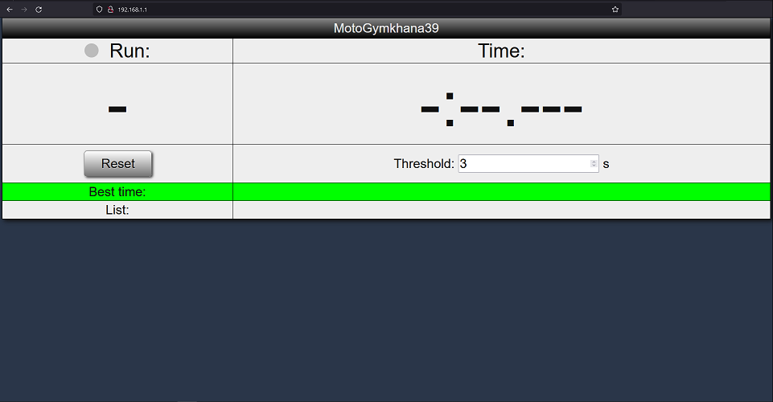
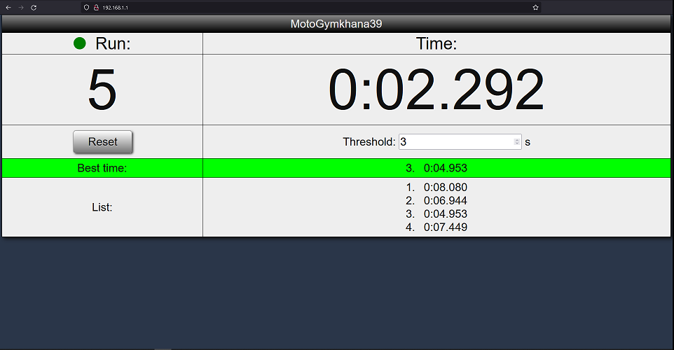

# ИНФОРМАЦИЯ ДОПОЛНЯЕТСЯ

## Gymkhana Run Timer
Таймер заездов на ESP8266 с веб-интерфейсом.
Основано на [проекте](https://create.arduino.cc/projecthub/DonKracho/esp8266-lap-timer-with-web-server-d6183a) DonKracho.

## About
Замеряет время одного заезда: старт-стоп. Возможно, в будущем будет добавлен второй режим: старт-круг-круг-круг...
После подачи напряжения ESP8266 создаёт точку доступа (имя задаётся в `SSID`) с сервером по адресу, заданному в `WEB_SERVER_IP` (по умолчанию: 192.168.1.1).
Просто подключаетесь к точке доступа, запустите любимый браузер и перейдите по адресу сервера `WEB_SERVER_IP`)

### Hardware
- MCU ESP8266 (например, плата Wemos D1 mini);
- E3F-R2NK Фотоэлектрический бесконтактный датчик (использовал тип NPN, нормально разомкнутый);
- Mini360 понижающий (в случае питания от 12 В аккумулятора) или повышающий (если питать 3.7-5 В) конвертер (датчик работает от 5 В, но дистанция срабатывания мала).

### Features
- Индикатор присутствия сигнала на датчике (полезная штука при выставлении датчика и отражателя);
- Номер текущего заезда и время;
- Список всех заездов;
- лучший заезд;
- Настраиваемое через веб-интерфейс время невосприимчивости к сигналам (после прерывания, система игнорирует последующие прерывания в течение `threshold_ms` мс).

## Arduino IDE settings
Для китайских WEMOS D1 mini выбирайте LOLIN(WEMOS) D1 R2 & mini

## Dependencies
Использовались следующие версии ПО и библиотек:
 - Arduino IDE 1.8.10
 - esp8266 board 2.5.2. Ссылка для менеджера плат: http://arduino.esp8266.com/stable/package_esp8266com_index.json

| Lib					| Version	| Source		|
| ----------------------|-----------|---------------|
| 1) ESP8266WebServer	| 1.0		| esp8266 board	|
| 2) ESP8266WiFi		| 1.0		| esp8266 board	|
| 3) WebSockets			| 2.3.6		| lib manager	|

